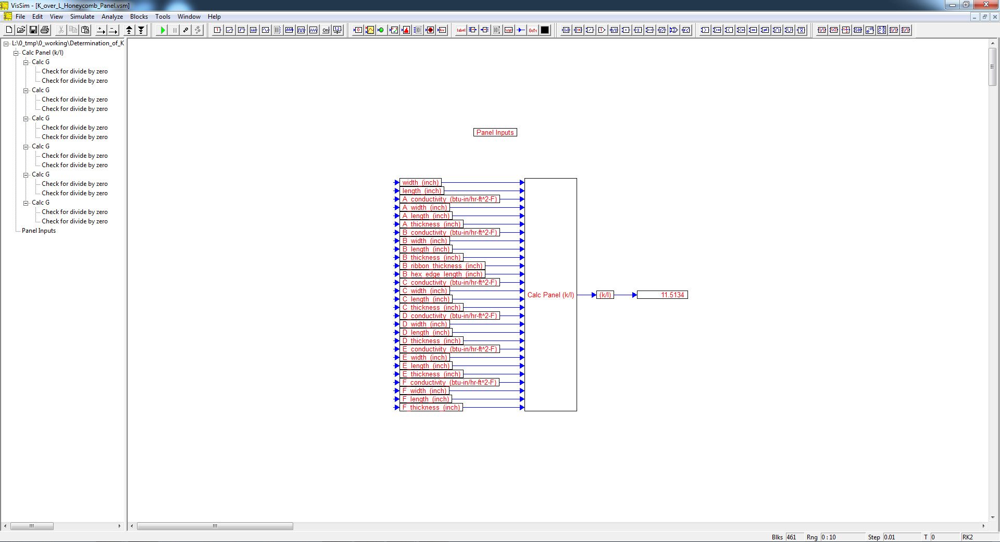

# ========================================
# Determination of K over L for Honeycomb Panel:
# ========================================

## Determination of K over L for Honeycomb Panel using VISSIM.

##
## I. Operation: "./VISSIM/K_over_L_Honeycomb_Panel.vsm"

##
## II. K/L for Honeycomb Panel Top Level Diagram:

##
## III. K/L for Honeycomb Panel Interior Sub-System Level Diagram:

##
## IV. Conductance Sub-System Level Diagram:

## 
## *Note: 
## 1. Performance Data and Analysis performed using VISSIM, ( https://web.solidthinking.com/vissim-is-now-solidthinking-embed )

